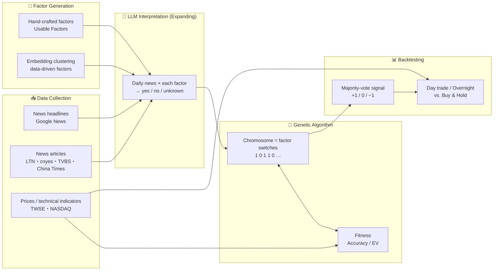

<div align="center">

# 📈 LLM-Predict-Stock

**Turning financial news into trading signals with Large Language Models and Genetic Algorithms**
*Leveraging Large Language Models and Genetic Algorithms to Turn Financial News into Trading Signals*

**English** | [台灣中文](README.zh-TW.md)

[](https://www.python.org/)
[](https://python.langchain.com/)
[](#-dataset)
[](LICENSE)
[](#-about)

[About](#-about) •
[Method](#-method) •
[Structure](#-project-structure) •
[Getting Started](#-getting-started) •
[Experiments](#-experiments--backtesting) •
[Dataset](#-dataset) •
[License](#-license)

</div>

---

## 📝 About

This repository contains the research code for my master's thesis, *An innovative hybrid investment model using large language models and genetic algorithms*.

Traditional quantitative factors rely mostly on price and volume data and struggle to capture the **qualitative information** in news in a timely way. This research lets a Large Language Model (LLM) act as a "financial analyst":

1. Define a set of **market factors** that may drive stock prices (e.g., revenue performance, foreign capital flows, monetary policy, supply chain, black-swan events…)
2. On each trading day, the LLM reads that day's news headlines and judges, **for each factor**, whether the stock will go up, go down, or cannot be determined
3. A **Genetic Algorithm (GA)** selects the most effective factor combination over the training period
4. A majority vote produces the daily trading signal, which is **backtested with day-trading / overnight strategies** in the test period and compared against Buy & Hold

The research focuses mainly on the Taiwan stock market.

### ✨ Highlights

- 🧠 **LLM factor interpretation**: models such as `gpt-4o-mini` and `gemini-1.5-flash` read news factor by factor and return explainable reasoning
- 🧬 **GA factor selection**: binary chromosomes switch factors on/off, evolved with Accuracy or Expected Value (EV) as the fitness function
- 💭 **Multiple prompting strategies**: Chain-of-Thought, Skeleton-of-Thought (SoT), Take-a-Step-Back, S2A, and more
- 🔍 **Embedding clustering**: news is embedded with `text-embedding-3-small` and clustered to derive factors from the data
- 🔁 **Backtesting**: fixed train/test split (TV) and sliding-window validation, with optional transaction costs
- 💾 **Result caching**: all LLM outputs are stored as JSON, so re-running experiments does not call the API again

---

## 🔬 Method



### 1. Factor Generation (Generator)

| Approach | Module | Description |
| --- | --- | --- |
| Hand-crafted factors | [module/generator_usable.py](backtest_llm_factor/module/generator_usable.py) | Curated market factors (one set each for Taiwan and US stocks); the first *N* can be selected (e.g., F8, F24, F42) |

### 2. LLM Interpretation (Expanding)

For each trading day *T*, the day's news headlines are sent to the LLM together with a single factor:

```text
This is the possible stock price change factor {factor}
Please consider the following news. Will stocks rise or fall because of {factor}?
This is today's news: {news}
Please answer yes if it is likely to rise, answer no if it is likely to fall,
and answer unknown if it is impossible to determine or irrelevant.
```

Taiwan stocks use an equivalent prompt in Traditional Chinese. Each response is parsed into a `+1 / −1 / 0` signal, and the reasoning is kept for analysis. The prompting strategies are implemented in `module/expand_stock_*.py`.

### 3. Genetic Algorithm (GA)

- **Chromosome**: a binary vector as long as the number of factors; `1` means the factor is used
- **Selection**: keep the top 50% of individuals by fitness
- **Crossover**: single-point crossover (crossover rate = 0.7)
- **Mutation**: bit flip (mutation rate = 0.005)
- **Fitness**: `mode=0` uses Accuracy, `mode=1` uses Expected Value (EV)
- **Defaults**: population 20, 50 generations; training resumes from `state.json` after an interruption

There are also `GA_MOV` and `GA_Volatility` variants, plus a Threshold version that encodes the majority-vote threshold into the chromosome.

### 4. Signals & Evaluation

The daily signal is a **majority vote** across the selected factors: go long (+1) if bullish votes outnumber bearish ones, go short (−1) if the reverse, and stay out (0) on a tie.

| Metric | Definition |
| --- | --- |
| Accuracy | (TP + TN) / (TP + FP + TN + FN) |
| Precision | TP / (TP + FP) |
| EV (Expected Value) | mean(gain) × Accuracy + mean(loss) × (1 − Accuracy) |
| Precision EV | Expected value of long signals only |
| Win vs. B&H | Whether the strategy's cumulative return beats Buy & Hold over the same period |

Transaction costs (commission, securities / futures transaction tax, slippage) can be set via `env['fee']`.

---

## 🗂 Project Structure

```text
LLM-Predict-Stock/
├── backtest_llm_factor/          # ⭐ Core: LLM factors + GA + backtesting
│   ├── module/                   #   Factor generation, LLM interpretation, GA, embedding
│   │   ├── generator_*.py        #     Factor generators
│   │   ├── expand_*.py           #     Per-factor LLM interpretation (CoT / SoT / Reason …)
│   │   ├── GA*.py                #     Genetic algorithm and variants
│   │   └── embed.py              #     News embedding
│   ├── eval/                     #   Backtest evaluation (day trade, overnight, threshold, B&H)
│   ├── factor*.py                #   Experiment base classes
│   ├── usable_*.py               #   Experiment settings (day trade / overnight / index / movement)
│   ├── TV_*.py                   #   Fixed train/test split experiments
│   ├── run_tv.ipynb              #   ▶ Main notebook for TV experiments
│   ├── run_sliding_window.ipynb  #   ▶ Main notebook for sliding-window experiments
│   ├── run_mix.ipynb             #   ▶ Mixed-factor experiments
│   └── out_stock/ out_twii/      #   Cached LLM outputs and experiment results
├── crawler/                      # 🕷️ Data crawlers
│   ├── news/                     #   News crawlers for four publishers (notebooks)
│   ├── news_title*.py            #   Google News headlines
│   ├── price_*.ipynb             #   TW / US stocks, TAIEX, and TAIEX futures prices
│   └── fwbtin.py, tx_crawler.py  #   Futures institutional investors, TAIEX futures ticks
├── history_data/                 # 📦 Historical data
│   ├── tw/                       #   Taiwan: news, headlines, prices
│   └── us/                       #   US: headlines, prices
├── tutorial/                     # 📚 Intro to LangChain / embeddings
├── test_files/                   # 🧪 Experimental tests
├── requirements.txt
├── .env.example
└── LICENSE
```

---

## 🚀 Getting Started

### Requirements

- Python **3.11** (developed on 3.11.7)
- OpenAI API key (required); Google Gemini API key (optional)
- Google Chrome (only for the crawlers, used by Selenium)

### Installation

```bash
git clone https://github.com/bofrankbo/LLM-Predict-Stock.git
cd LLM-Predict-Stock

python -m venv .venv
# macOS / Linux
source .venv/bin/activate
# Windows
.venv\Scripts\activate

pip install -r requirements.txt
```

### API Keys

Copy `.env.example` to `.env` and fill in your keys, or set the environment variables directly:

```bash
export OPENAI_API_KEY="sk-..."
export GEMINI_API_KEY="..."        # optional
```

### Running Experiments

All paths are relative to the **project root**. The first cell of each notebook switches the working directory to the root automatically.

```bash
jupyter notebook backtest_llm_factor/run_tv.ipynb
```

Or call it directly from Python:

```python
from backtest_llm_factor.TV_usable_dt_stock import TV_UsableDT

env = {
    "stock_id": "2330",
    "stock_name": "TSMC",
    "country": "tw",          # "tw" or "us"
    "start_date": "20230401",
    "end_date": "20240331",
    "tv": 15,                 # train/test split ratio parameter
    "run_count": "1",
}

exp = TV_UsableDT(env, factors_count=8, expand=1)
exp.run()                                           # Generate factors + LLM interpretation (skipped if cached)
train_range, test_range = exp.split_exp(tv=env["tv"])
exp.training(mode=1, train_datarange=train_range,   # mode 0: Accuracy / 1: EV
             test_datarange=test_range)
```

> 💡 `out_stock/` already contains the cached LLM outputs from the thesis experiments, so the results can be reproduced without spending any API credits.

---

## 🧪 Experiments & Backtesting

| Experiment | Entry point | Description |
| --- | --- | --- |
| TV-1 Factor | `run_tv.ipynb` → `TV_UsableDT` | Fixed split, GA factor selection, day-trade backtest |
| TV-2 Factor Threshold | `run_tv.ipynb` → `TV_UsableExpThresDT` | Evolves the majority-vote threshold with the GA as well |
| TV-3 Threshold + SoT | `run_tv.ipynb` → `TV_UsableExpThresSoT` | LLM interpretation with Skeleton-of-Thought |
| Sliding Window | `run_sliding_window.ipynb` | Train on 3 quarters, test on 1, rolling quarter by quarter |
| Overnight | `usable_on*.py`, `factor_overnight*.py` | Overnight strategy (enter at close, exit at next open) |
| Index / TAIEX Futures | `usable_index.py`, `usable_on_index.py` | Predict the index from constituent news |
| Embedding Factor | `module/generator_embd.py` | Factors generated automatically from news clusters |
| Mix | `run_mix.ipynb` | Combining multiple factor sets / strategies |

### 📊 Key Results

<!-- TODO: add the main results table or chart from the thesis (e.g., docs/img/result.png) -->

| Market | Strategy | Accuracy | EV | Win vs. B&H |
| --- | --- | :---: | :---: | :---: |
| Taiwan | TODO | – | – | – |
| US | TODO | – | – | – |

See the full thesis for detailed results and analysis.

---

## 📦 Dataset

| Data | Path | Source |
| --- | --- | --- |
| Taiwan news articles | `history_data/tw/stock_news/` | Liberty Times, cnyes, TVBS, China Times |
| News headlines | `history_data/{tw,us}/news_title/` | Google News |
| Taiwan prices + technical indicators | `history_data/tw/stock_price/{id}tech.csv` | Taiwan Stock Exchange (TWSE) |
| US prices + technical indicators | `history_data/us/stock_price/{ticker}tech.csv` | NASDAQ |
| TAIEX futures ticks, institutional investors | [Google Drive](https://drive.google.com/drive/folders/1L-pGrVa4V3i1z3XF1vpQe-qZtFHOS6cG?usp=sharing) | Taiwan Futures Exchange (TAIFEX) |

**Coverage**

- 🇹🇼 Taiwan: 31 large-cap stocks including TSMC 2330, MediaTek 2454, Hon Hai 2317, Quanta 2382, Wiwynn 3231, Chunghwa Telecom 2412, Fubon Financial 2881, plus the TAIEX index / TAIEX futures
- 🇺🇸 US: 42 stocks including AAPL, MSFT, NVDA, GOOGL, AMZN, META, TSLA, and the Dow Jones 30 components

Price CSVs include `Date, Open, High, Low, Close, Volume`, plus technical indicators such as MA5/10/20 and EMA1–256.

> ⚠️ News content is copyrighted by the original publishers. This repository is for academic research only and must not be used for commercial purposes.

---

## 🤖 Models

| Purpose | Model | Parameters |
| --- | --- | --- |
| Factor interpretation | `gpt-4o-mini` (primary), `gemini-1.5-flash`, `gemini-1.0-pro` | temperature = 1 |
| News embedding | `text-embedding-3-small` | – |

---

## ⚠️ Disclaimer

This project is for **academic research and educational purposes only** and does not constitute investment advice. Backtest results do not guarantee future performance, and LLM outputs may be wrong. Any investment decision made based on this project is at your own risk.

---

## 📄 License

The code in this project is licensed under the [MIT License](LICENSE).

The news and market data in `history_data/` belong to their original providers and are not covered by the MIT License.
