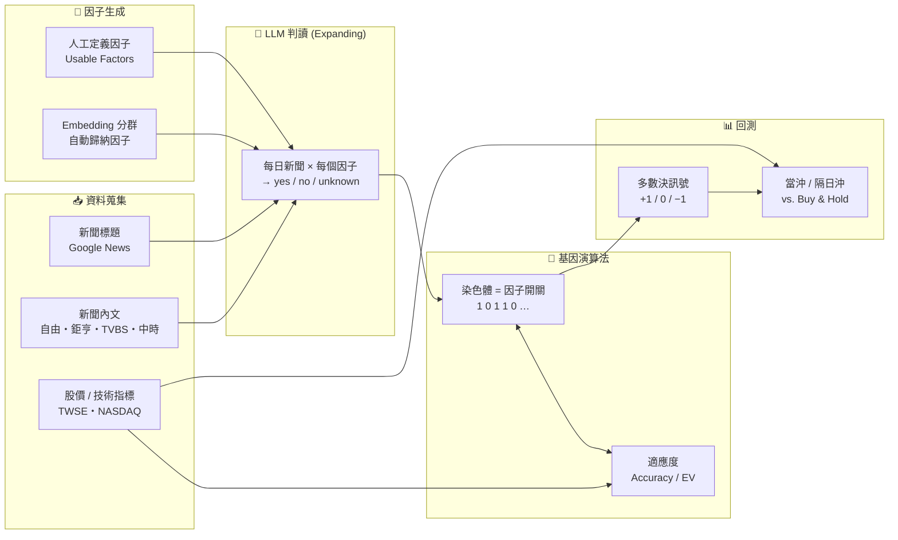

<div align="center">

# 📈 LLM-Predict-Stock

**以大型語言模型萃取新聞因子，結合基因演算法進行股價漲跌預測與回測**

*Leveraging Large Language Models and Genetic Algorithms to Turn Financial News into Trading Signals*

[English](README.md) | **繁體中文**

[](https://www.python.org/)
[](https://python.langchain.com/)
[](#-資料集)
[](LICENSE)
[](#-簡介)

[簡介](#-簡介) •
[方法](#-方法架構) •
[專案結構](#-專案結構) •
[快速開始](#-快速開始) •
[實驗](#-實驗與回測) •
[資料集](#-資料集) •
[授權](#-授權條款)

</div>

---

## 📝 簡介

本專案為碩士論文一個植基於生成式預訓練模型及遺傳演算法所建構的投資模型

傳統量化因子多半依賴價量資料，難以即時反映新聞中的**質化資訊**。本研究嘗試讓大型語言模型（LLM）扮演「金融分析師」：

1. 先定義一組可能影響股價的**市場因子**（如營收表現、外資動向、貨幣政策、供應鏈、黑天鵝事件……）
2. 每個交易日，讓 LLM 閱讀當日新聞標題，**針對每一個因子**判斷股價會「上漲 / 下跌 / 無法判斷」
3. 以**基因演算法（Genetic Algorithm, GA）** 在訓練期間挑選出最有效的因子組合
4. 以多數決產生當日交易訊號，並在測試期間進行**當沖 / 隔日沖回測**，與 Buy & Hold 比較

研究主要涵蓋台股市場。

### ✨ 特色

- 🧠 **LLM 因子判讀**：以 `gpt-4o-mini`、`gemini-1.5-flash` 等模型逐因子解讀新聞，輸出可解釋的判斷理由
- 🧬 **GA 因子選擇**：以二元染色體表示因子開關，以準確率（Accuracy）或期望值（EV）為適應度函數演化
- 💭 **多種 Prompting 策略**：Chain-of-Thought、Skeleton-of-Thought（SoT）、Take-a-Step-Back、S2A 等
- 🔍 **Embedding 分群**：以 `text-embedding-3-small` 將新聞向量化並分群，由資料自動歸納因子
- 🔁 **回測**：固定訓練 / 測試切分（TV）與滑動視窗（Sliding Window）兩種驗證方式，並可計入交易成本
- 💾 **結果快取**：LLM 判讀結果皆存為 JSON，重跑實驗不需重複呼叫 API

---

## 🔬 方法架構



### 1. 因子生成（Generator）

| 方式 | 模組 | 說明 |
| --- | --- | --- |
| 人工定義因子 | [module/generator_usable.py](backtest_llm_factor/module/generator_usable.py) | 預先整理的市場因子（台股 / 美股各一套），可指定取用前 *N* 個（例如 F8、F24、F42） |

### 2. LLM 判讀（Expanding）

針對每個交易日 *T*，將當日新聞標題與單一因子一起送入 LLM，要求回答：

```text
這是股價變動因素 {factor}
請思考以下新聞，是否會因為 {factor} 而使股票上漲或下跌？
這是今天的新聞: {news}
如果可能上漲請回答 yes，如果可能下跌則回答 no，如果無法判斷或無關則回答 unknown。
```

回覆被解析為訊號 `+1 / −1 / 0`，並保留理由以供分析。不同 prompting 策略實作於 `module/expand_stock_*.py`。

### 3. 基因演算法（GA）

- **染色體**：長度等於因子數的二元向量，`1` 表示採用該因子
- **選擇**：保留適應度前 50% 的個體
- **交配**：單點交配（crossover rate = 0.7）
- **突變**：位元翻轉（mutation rate = 0.005）
- **適應度**：`mode=0` 使用 Accuracy、`mode=1` 使用期望值 EV
- **預設參數**：族群 20、世代 50；支援中斷後由 `state.json` 接續訓練

另有 `GA_MOV`、`GA_Volatility` 變體，以及將「多數決門檻」一併編碼進染色體的 Threshold 版本。

### 4. 訊號與評估

當日訊號為所有被選中因子的**多數決**：看漲票數多於看跌則做多（+1），反之做空（−1），平手則不交易（0）。

| 指標 | 定義 |
| --- | --- |
| Accuracy | (TP + TN) / (TP + FP + TN + FN) |
| Precision | TP / (TP + FP) |
| EV（期望值） | mean(gain) × Accuracy + mean(loss) × (1 − Accuracy) |
| Precision EV | 僅計算做多訊號的期望值 |
| Win vs. B&H | 策略累積報酬是否勝過同期 Buy & Hold |

交易成本（手續費、證交稅、期交稅、滑價）可透過 `env['fee']` 設定。

---

## 🗂 專案結構

```text
LLM-Predict-Stock/
├── backtest_llm_factor/          # ⭐ 核心：LLM 因子 + GA + 回測
│   ├── module/                   #   因子生成、LLM 判讀、GA、Embedding
│   │   ├── generator_*.py        #     因子生成器
│   │   ├── expand_*.py           #     LLM 逐因子判讀（CoT / SoT / Reason …）
│   │   ├── GA*.py                #     基因演算法及其變體
│   │   └── embed.py              #     新聞 Embedding
│   ├── eval/                     #   回測評估（當沖、隔日沖、門檻、B&H）
│   ├── factor*.py                #   實驗基底類別
│   ├── usable_*.py               #   各實驗設定（當沖 / 隔日沖 / 指數 / 漲跌幅）
│   ├── TV_*.py                   #   固定訓練 / 測試切分實驗
│   ├── run_tv.ipynb              #   ▶ TV 實驗主程式
│   ├── run_sliding_window.ipynb  #   ▶ 滑動視窗實驗主程式
│   ├── run_mix.ipynb             #   ▶ 混合因子實驗
│   └── out_stock/ out_twii/      #   LLM 判讀快取與實驗結果
├── crawler/                      # 🕷️ 資料爬蟲
│   ├── news/                     #   四家報社新聞爬蟲（notebook）
│   ├── news_title*.py            #   Google News 新聞標題
│   ├── price_*.ipynb             #   台股 / 美股 / 加權指數 / 台指期價格
│   └── fwbtin.py, tx_crawler.py  #   期貨三大法人、台指期逐筆
├── history_data/                 # 📦 歷史資料
│   ├── tw/                       #   台股：新聞、新聞標題、股價
│   └── us/                       #   美股：新聞標題、股價
├── tutorial/                     # 📚 LangChain / Embedding 入門教學
├── test_files/                   # 🧪 實驗性測試
├── requirements.txt
├── .env.example
└── LICENSE
```

---

## 🚀 快速開始

### 環境需求

- Python **3.11**（開發環境為 3.11.7）
- OpenAI API Key（必要）；Google Gemini API Key（選用）
- Google Chrome（僅爬蟲需要，供 Selenium 使用）

### 安裝

```bash
git clone https://github.com/bofrankbo/LLM-Predict-Stock.git
cd LLM-Predict-Stock

python -m venv .venv
# macOS / Linux
source .venv/bin/activate
# Windows
.venv\Scripts\activate

pip install -r requirements.txt
```

### 設定 API Key

複製 `.env.example` 為 `.env` 並填入金鑰，或直接設定環境變數：

```bash
export OPENAI_API_KEY="sk-..."
export GEMINI_API_KEY="..."        # 選用
```

### 執行實驗

所有路徑皆以**專案根目錄**為基準。Notebook 第一個 cell 會自動將工作目錄切換到根目錄。

```bash
jupyter notebook backtest_llm_factor/run_tv.ipynb
```

或在 Python 中直接呼叫：

```python
from backtest_llm_factor.TV_usable_dt_stock import TV_UsableDT

env = {
    "stock_id": "2330",
    "stock_name": "台積電",
    "country": "tw",          # "tw" 或 "us"
    "start_date": "20230401",
    "end_date": "20240331",
    "tv": 15,                 # 訓練 / 測試切分比例參數
    "run_count": "1",
}

exp = TV_UsableDT(env, factors_count=8, expand=1)
exp.run()                                           # 生成因子 + LLM 判讀（有快取則略過）
train_range, test_range = exp.split_exp(tv=env["tv"])
exp.training(mode=1, train_datarange=train_range,   # mode 0: Accuracy / 1: EV
             test_datarange=test_range)
```

> 💡 `out_stock/` 已包含論文實驗的 LLM 判讀結果快取，直接執行即可重現結果，不會重新消耗 API 額度。

---

## 🧪 實驗與回測

| 實驗 | 入口 | 說明 |
| --- | --- | --- |
| TV-1 Factor | `run_tv.ipynb` → `TV_UsableDT` | 固定切分，GA 選擇因子，當沖回測 |
| TV-2 Factor Threshold | `run_tv.ipynb` → `TV_UsableExpThresDT` | 將多數決門檻一併納入 GA 演化 |
| TV-3 Threshold + SoT | `run_tv.ipynb` → `TV_UsableExpThresSoT` | 以 Skeleton-of-Thought 進行 LLM 判讀 |
| Sliding Window | `run_sliding_window.ipynb` | 以 3 季訓練、1 季測試，逐季滾動 |
| Overnight | `usable_on*.py`、`factor_overnight*.py` | 隔日沖（收盤進、開盤出）策略 |
| Index / 台指期 | `usable_index.py`、`usable_on_index.py` | 以成分股新聞預測指數 |
| Embedding Factor | `module/generator_embd.py` | 由新聞分群自動產生因子 |
| Mix | `run_mix.ipynb` | 混合多組因子 / 策略 |

### 📊 主要結果

<!-- TODO: 放上論文中的主要結果表格或圖表（例如 docs/img/result.png） -->

| 市場 | 策略 | Accuracy | EV | Win vs. B&H |
| --- | --- | :---: | :---: | :---: |
| 台股 | TODO | – | – | – |
| 美股 | TODO | – | – | – |

詳細數據與分析請參閱論文全文。

---

## 📦 資料集

| 資料 | 路徑 | 來源 |
| --- | --- | --- |
| 台股新聞內文 | `history_data/tw/stock_news/` | 自由時報、鉅亨網、TVBS、中時新聞網 |
| 新聞標題 | `history_data/{tw,us}/news_title/` | Google News |
| 台股股價 + 技術指標 | `history_data/tw/stock_price/{id}tech.csv` | 臺灣證券交易所 |
| 美股股價 + 技術指標 | `history_data/us/stock_price/{ticker}tech.csv` | NASDAQ |
| 台指期逐筆、三大法人 | [Google Drive](https://drive.google.com/drive/folders/1L-pGrVa4V3i1z3XF1vpQe-qZtFHOS6cG?usp=sharing) | 臺灣期貨交易所 |

**研究標的**

- 🇹🇼 台股：台積電 2330、聯發科 2454、鴻海 2317、廣達 2382、緯創 3231、中華電 2412、富邦金 2881 等 31 檔權值股，以及加權指數 / 台指期
- 🇺🇸 美股：AAPL、MSFT、NVDA、GOOGL、AMZN、META、TSLA 及道瓊 30 成分股等 42 檔

股價 CSV 欄位包含 `Date, Open, High, Low, Close, Volume`，以及 MA5/10/20 與 EMA1–256 等技術指標。

> ⚠️ 新聞內容之著作權屬於原發布媒體，本 repository 僅供學術研究使用，請勿轉作商業用途。

---

## 🤖 模型設定

| 用途 | 模型 | 參數 |
| --- | --- | --- |
| 因子判讀 | `gpt-4o-mini`（主要）、`gemini-1.5-flash`、`gemini-1.0-pro` | temperature = 1 |
| 新聞向量化 | `text-embedding-3-small` | – |

---

## ⚠️ 免責聲明

本專案僅供**學術研究與教育用途**，不構成任何投資建議。回測結果不代表未來績效，LLM 的輸出亦可能有誤。依本專案內容進行任何投資決策之風險由使用者自行承擔。

---

## 📄 授權條款

本專案程式碼採用 [MIT License](LICENSE) 授權。

`history_data/` 中的新聞與市場資料之權利歸屬於原資料提供者，不在 MIT 授權範圍內。